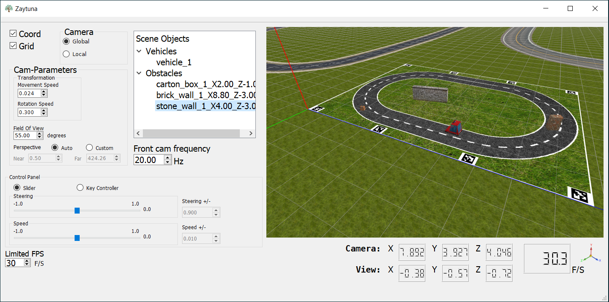
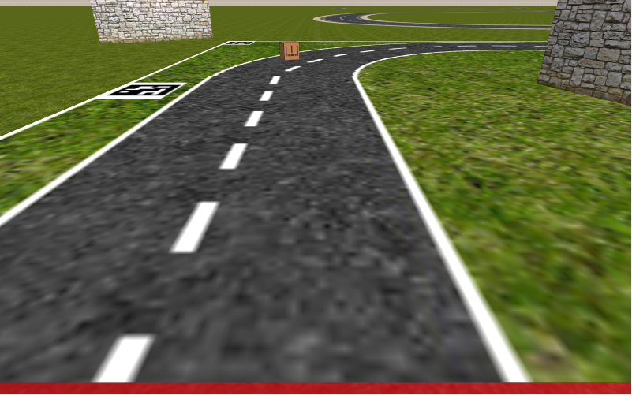
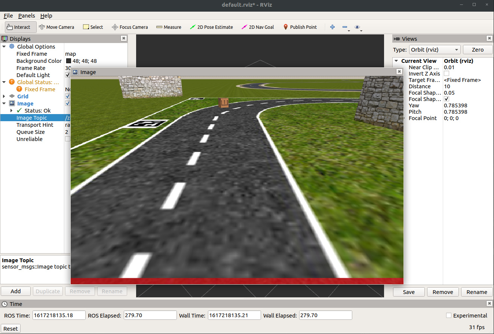

    

  

# 3D Self-Driving Car Simulator with ROS  :deciduous_tree:
**Zaytuna** is a very simple, lightweight 3D simulator for a mini autonomous self-driving car that is programmable with [ROS](https://www.ros.org).  
The simulator is meant to be used for educational purposes only!
  
:exclamation: **Note:** Not suitable for virtual machine. You'll not be able to run it in Virtualbox or on a guest operating system. And if you've ever got it to run on a guest OS, the scene won't render properly, and therefore will not be suitable to drive with vision. For a simulator you usually need an actual graphic card, and not emulated one.  
  
**Here is a rushed walkthrough video! Alternatively, you can also watch it in slow motion on YouTube [here](https://youtu.be/H7O3mLU8WCk).**

https://user-images.githubusercontent.com/38502426/130468381-036f6f0a-0891-4986-b3ba-2d751c1ceba9.mp4

  
For any bug reports or suggestions, please use the above `Issues`/`Discussions` dialogs.  

**Requirements:**   ROS.  "*No support for ROS2 yet!*"  
If you haven't yet, you need to install a [ROS](https://www.ros.org) version that is supported on your operating system. And make sure that ROS [environment variables](http://wiki.ros.org/ROS/Tutorials/InstallingandConfiguringROSEnvironment#Managing_Your_Environment) are setup properly.
  
**Building the package:** If you know how to build a [ROS package](http://wiki.ros.org/ROS/Tutorials/CreatingPackage), you probably don't need to read the rest. Otherwise, it's more convenient to go through these [tutorials](http://wiki.ros.org/ROS/Tutorials) first.  
To build the package open a terminal and navigate to `src` folder in your [catkin workspace](http://wiki.ros.org/ROS/Tutorials/InstallingandConfiguringROSEnvironment#Create_a_ROS_Workspace), assuming your catkin workspace is named `catkin_ws`, then run the following commands:  
+ `:~/catkin_ws/src$ git clone https://github.com/ChevronOne/zaytuna.git`
+ `:~/catkin_ws/src$ cd ..`
+ `:~/catkin_ws$ catkin_make` or `:~/catkin_ws$ catkin build` depending on which command you've used when you first build your **catkin workspace**

If the build was successful, open a second terminal and run the command `roscore`, and in the current terminal run the command `rosrun zaytuna zay_simu`. And there you have it!

By default, there should be a model vehicle with some obstacles. However, you can delete or add up to 10 model vehicles and up to 5000 obstacles as needed. 

To see the topics of the simulated model vehicle, open a third terminal and run the command `rostopic list`. Currently there is no documentation or tutorials of how to use them, but if you're familiar with ROS, then most of them should be self-explanatory.  
To navigate in the scene use `W`, `S`, `A`, `D`, `Up`, `Down`, `Right` and `Left` keys. And for orientation use mouse pointer. If a model vehicle is connected to control panel with *Key-Controller* chosen, you can move it with `T`, `G`, `F` and `H` keys, but then you'll need to detach it manually from control panel in order to make it listen to ROS-topics again.  

The simulator provides simulations for almost all basic sensors that are needed for a self-driving car to be programmed. The only topic that's missing is **LiDAR**/**Laser Scanner**, but a model vehicle still can be fully driven with vision.  
The subscribers of ***speed*** and ***steering*** each takes a value within a range of [-1,1]. For steering value 1.0 simulates 25 degrees right-turn of front wheels, and -1.0 the same for left turn. And for speed 1.0 simulates full speed in forward direction and -1.0 the same for backward direction.  

Depending on how much it could be used, there might be a consideration to work on a lidar-simulation as well. However the aim is to keep it simple and lightweight as possible, and avoid using any heavy dependencies or physic libraries.  
  
## Screenshots:  
**Zaytuna-Simulator**  

**The View from Vehicle's Camera**  

**Vehicle's Camera from ROS Visualizer App (rviz)**  

  
**Note:** The word Zaytuna means '*an olive tree*' :seedling:
